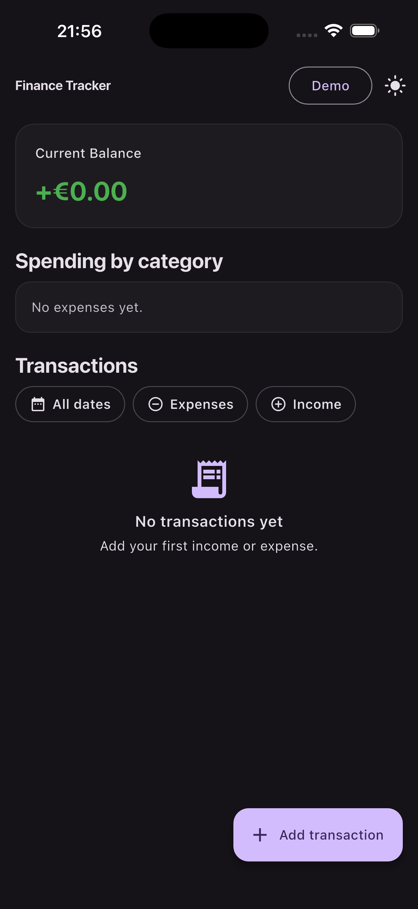
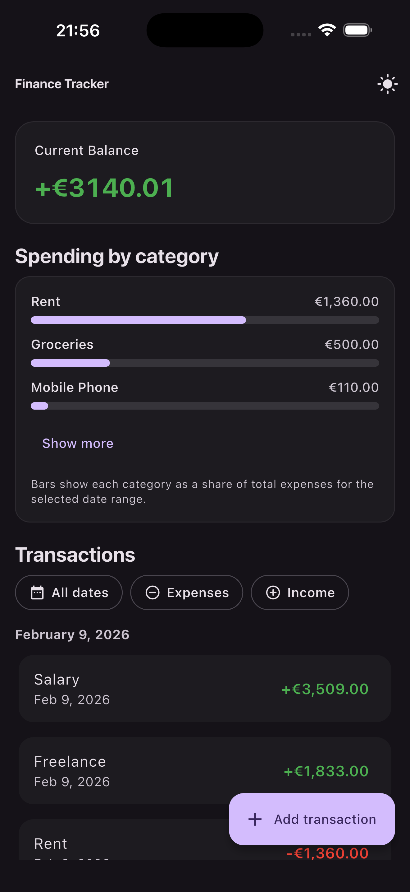
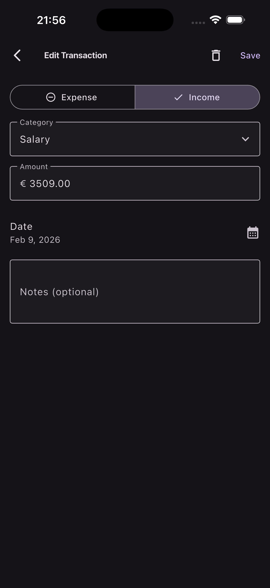

# Personal Finance Tracker App

## 📸 App Screenshots

  
  
  

## Take-Home Requirements

### Scope

- ✅ Build a simple personal finance tracker app to log expenses and income, view balance, and
  categorize transactions.

### Core Functionality

- ✅ Add transactions (income or expense) with amount, category, date, and optional notes.
- ✅ Display a list of all transactions.
- ✅ Show current balance at the top of the screen.
- ✅ Filter transactions by type (income, expense, all).
- ✅ Persist data locally so it survives app restarts.

### Technical Requirements

- ✅ Use Bloc for state management (transactions list, balance calculation, filters).
- ✅ Implement theming with light and dark mode toggle, with persisted preference.
- ✅ Use SharedPreferences for theme preference.
- ✅ Use a database like SQLite or a persistence framework like Hive for transaction storage.
- ✅ Follow Flutter best practices and Material Design guidelines.

### Deliverables

- ✅ Repository (private or public) with a clear README explaining architecture decisions,
  trade-offs or shortcuts, and what you would improve with more time.

### Bonus (Optional)

- ✅ Unit tests for Bloc logic.
- ✅ Form validation.
- ✅ Transaction editing and deletion.
- ✅ Date range filtering.
- ✅ Simple charts showing spending by category.

### Extra Features (Beyond Requirements)

- Demo data button in the AppBar (adds a predefined set of transactions, then hides).
- Pull-to-refresh on the Home page.
- Animated balance using `AnimatedFlipCounter`.
- Category picker with search (bottom sheet) when adding/editing a transaction.
- Transactions grouped by date in the list.
- Swipe-to-delete on transactions (Dismissible).

### Architecture Decisions

- State management uses two Cubits: `TransactionsCubit` for data/filter/balance and `ThemeCubit` for
  theme mode.
- Persistence uses Hive with a repository abstraction (`TransactionRepository`) to keep data access
  separate from UI.
- UI is split into screens and widgets (`HomePage`, `AddEditTransactionPage`, `TransactionTile`).

### Trade-offs / Shortcuts

- Category list is predefined and not user-configurable.

### Demo Data

- The Home app bar includes a **Demo** button (outlined) that inserts a small,
  realistic set of income/expense transactions for quick previews.
- The button hides automatically once transactions exist.

### With More Time

- Enhanced Charting: Show detailed trends over time, including weekly, monthly, and yearly
  breakdowns with interactive charts.
- Category & Currency Management: Allow users to create and customize categories, and support
  multiple currencies with proper formatting and localization.
- Transaction Tags: Enable tagging transactions for easier filtering, grouping, and insights.
- Search & Filter: Add a search bar and filters to quickly find transactions by name, amount,
  date, or category.
- Receipt Capture: Let users attach photos of receipts to transactions for better tracking
  and record-keeping.
- Budget & Goal Tracking (optional future feature): Provide tools to set budgets and savings
  goals, with alerts for overspending.

### Estimated Time Spent

- ~5 hours (implementation + documentation).
